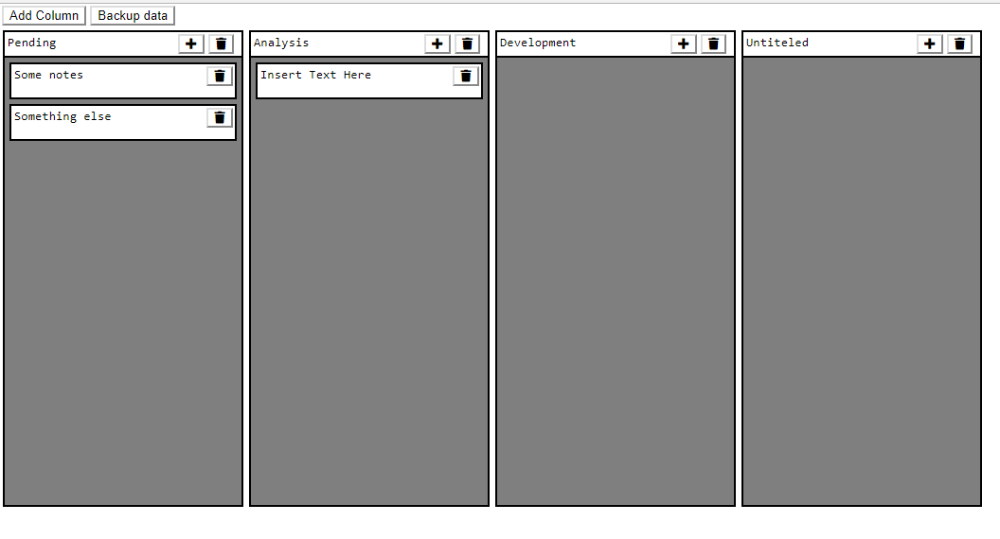

# Kanban board

Custom Kanban board made with plain javascript. It uses jquery for some minor things, and could be refactored to avoid third party libraries usage.It also uses font-awesome for the icons

Tested in chrome and firefox 

* Insert columns and delete
* Edit the name of the columns
* Insert and delete notes
* Edit the text of the notes
* Move notes from one column to another
* Change the order from the notes within the column and between columns
* Loads the default kanban from the file `kanban_challenge.json`
    * it loads the url `'/kanban-board/kanban_challenge.json'` using `get`
* Output via console a stringified version of the kanban, for storage.

Check the console for logs and info.

#### Improvements
* change textareas for divs when not editing texts
* when a textarea contains multiple lines, drag and drops does not work properly, it is better to click outside the textarea to move the note

#### Screenshot

